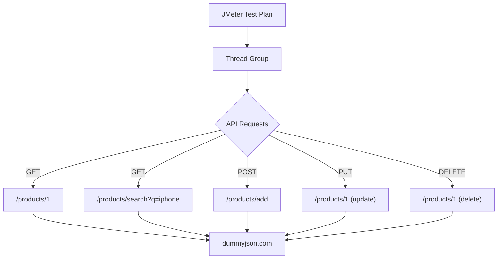

# JMeter API Performance Test Documentation

## Overview
This document outlines the configuration and structure of the JMeter Test Plan (`RequestExamples.jmx`). The test plan is designed to perform performance testing on the `dummyjson.com` API, covering various HTTP methods including GET, POST, PUT, and DELETE operations for the Products endpoint.

## Architecture & Data Flow



## Test Configuration Parameters

The Thread Group utilizes parameterized properties to allow flexible execution without modifying the `.jmx` file directly. These parameters can be passed via command line properties (e.g., `-Juser_count=10`).

| Parameter Name | JMeter Property | Description |
|---|---|---|
| `user_count` | `${__P(user_count)}` | The number of concurrent threads (users) to simulate. |
| `ramp_up_time` | `${__P(ramp_up_time)}` | The time (in seconds) to start all threads. |
| `loop_count` | `${__P(loop_count)}` | The number of iterations each thread will execute. |

## API Endpoints Overview

All requests are directed to the base URL:
**Base URL:** `https://dummyjson.com`

### 1. GET Request without Any Param
Retrieves details of a specific product.

* **Method:** `GET`
* **Path:** `/products/1`
* **Description:** Fetches product details for the product with ID `1`.

### 2. Get with Request Parameter
Searches for products based on a query parameter.

* **Method:** `GET`
* **Path:** `/products/search`
* **Query Parameters:**
  * `q`: `iphone`
* **Description:** Performs a search for products matching the query "iphone".

### 3. Post Products with Body
Creates a new product entry.

* **Method:** `POST`
* **Path:** `/products/add`
* **Request Body:**
```json
{
  "title": "BMW Pencil"
}
```

### 4. Update Products
Updates an existing product.

* **Method:** `PUT`
* **Path:** `/products/1`
* **Request Body:**
```json
{
  "title": "BMW Pencil"
}
```

### 5. Delete Products
Removes an existing product.

* **Method:** `DELETE`
* **Path:** `/products/1`
* **Description:** Deletes the product with ID `1`.

## Results Collection

The test plan includes a **View Results Tree** listener configured to record detailed execution metrics:
* Time & Latency
* Timestamp
* Success/Failure Status
* Response Codes and Messages
* Thread Names
* Bytes and Sent Bytes
* URL and Connection Time

**Note:** For performance reasons during heavy load testing, it is recommended to run JMeter in non-GUI mode and disable or remove the View Results Tree listener.
